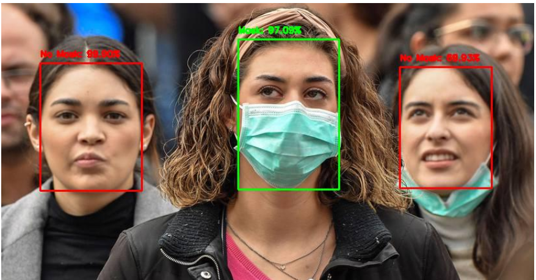

<h1 align="center">Mask Detection</h1>

<div align= "center">
  <h4>Face Mask Detection System built with OpenCV, Keras/TensorFlow using Deep Learning and Computer Vision concepts in order to detect face masks in static images as well as in real-time video streams.</h4>
</div>

&nbsp;&nbsp;&nbsp;&nbsp;&nbsp;&nbsp;&nbsp;&nbsp;&nbsp;&nbsp;&nbsp;&nbsp;&nbsp;&nbsp;&nbsp;&nbsp;&nbsp;&nbsp;&nbsp;&nbsp;&nbsp;&nbsp;&nbsp;&nbsp;&nbsp;&nbsp;&nbsp;&nbsp;&nbsp;&nbsp;

[](https://github.com/chandrikadeb7/Face-Mask-Detection/issues)


&nbsp;&nbsp;&nbsp;&nbsp;&nbsp;&nbsp;&nbsp;&nbsp;&nbsp;&nbsp;&nbsp;&nbsp;&nbsp;&nbsp;&nbsp;&nbsp;&nbsp;&nbsp;&nbsp;&nbsp;&nbsp;&nbsp;&nbsp;&nbsp;&nbsp;&nbsp;&nbsp;&nbsp;&nbsp;&nbsp;&nbsp;&nbsp;&nbsp;&nbsp;&nbsp;


## :innocent: Motivation
Amid the ongoing COVID-19 pandemic, there are no efficient face mask detection applications which are now in high demand for transportation means, densely populated areas, residential districts, large-scale manufacturers and other enterprises to ensure safety. The absence of large datasets of __‘with_mask’__ images has made this task cumbersome and challenging. 


<p align="center"></p>


## :warning: TechStack/framework used

- [OpenCV](https://opencv.org/)
- [haarcascade_frontalface_default](https://github.com/kipr/opencv/blob/master/data/haarcascades/haarcascade_frontalface_default.xml)
- [Keras](https://keras.io/)
- [TensorFlow](https://www.tensorflow.org/)

## :star: Features
Our face mask detector doesn't use any morphed masked images dataset and the model is accurate. This system can therefore be used in real-time applications which require face-mask detection for safety purposes due to the outbreak of Covid-19. This project can be integrated with embedded systems for application in airports, railway stations, offices, schools, and public places to ensure that public safety guidelines are followed.

## :file_folder: Dataset
The dataset used can be downloaded here - [Click to Download](https://www.kaggle.com/datasets/shiekhburhan/face-mask-dataset)

This dataset consists __14535 images__ belonging to two classes:
*	__incorrect_mask: 2165 images__
*	__without_mask: 4746 images__
*	__with_mask: 4789 images__

The images used were real images of faces wearing masks. The images were collected from the following sources:

* __Kaggle datasets__ 


## :key: Prerequisites

All the dependencies and required libraries are included in the file <code>requirements.txt</code>

## 🚀&nbsp; Installation
1. Clone the repo
```
$ git clone https://github.com/RohullahAkbari/Mask_Detection.git
```

2. Change your directory to the cloned repo 
```
$ cd Mask_Detection
```

3. Create a Python virtual environment named 'test' and activate it
```
$ virtualenv test
```
```
$ source test/bin/activate
```

4. Now, run the following command in your Terminal/Command Prompt to install the libraries required
```
$ pip install -r requirements.txt
```

## :bulb: Working

 Open terminal. Go into the cloned project directory and type the following command:
```
$ python Real_time_mask_detection.py 
```

## :key: Results


#### Our model gave 98% accuracy for Face Mask Detection after training via <code>tensorflow-gpu==2.5.0</code>

<a href="https://colab.research.google.com/drive/1AZ0W2QAHnM3rcj0qbTmc7c3fAMPCowQ1?usp=sharing"></a>
####          


#### We got the following accuracy/loss training curve plot


## Streamlit app

Face Mask Detector webapp using Tensorflow & Streamlit

command
```
$ streamlit run app.py 
```
## Images

<p align="center">
  
</p>
<p align="center">Upload Images</p>

<p align="center">
  
</p>
<p align="center">Results</p>

## :clap: And it's done!
<p><a>hasib.aman7@gmail.com</a></p>
